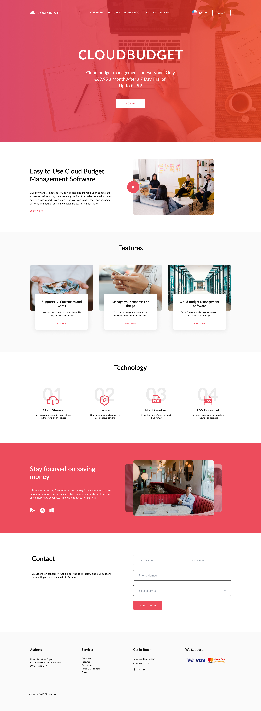

# CloudBudget

Лендинг сервиса для управления личным бюджетом, разработанный на React. Проект реализует современный одностраничный интерфейс с навигацией, презентацией возможностей сервиса, технологическими преимуществами, блоком о мобильном использовании и контактной формой.

## О проекте

* Главная страница сервиса CloudBudget.
* Навигация по основным разделам сайта.
* Главный экран с описанием сервиса, стоимостью и кнопкой регистрации.
* Секция с описанием программного обеспечения для управления бюджетом.
* Блок с основными возможностями сервиса.
* Секция с технологиями и дополнительными возможностями.
* Блок с преимуществами контроля расходов и экономии средств.
* Визуальная галерея интерфейса сервиса.
* Контактная форма для связи с командой поддержки.
* Footer с адресом, услугами, контактами, социальными сетями и информацией о поддержке.

## Реализованные темы

* Компонентная архитектура React.
* Разделение страницы на отдельные компоненты.
* Создание переиспользуемых UI-секций.
* JSX-разметка.
* Импорт и использование изображений в React.
* Создание навигационного меню.
* Создание карточек преимуществ и технологий.
* Создание контактной формы.
* Работа с `input`, `select`, `button` и `form`.
* Организация структуры страницы через компоненты.
* Разделение CSS-стилей по отдельным компонентам.

## Структура компонентов

* `App` — главный компонент, объединяющий все секции страницы.
* `Navigation` — верхняя навигация, логотип, меню, язык и кнопка авторизации.
* `Header` — главный экран с описанием сервиса и CTA-кнопкой.
* `Program` — описание программного обеспечения для управления бюджетом.
* `Feature` — карточки основных возможностей сервиса.
* `Technology` — блок с технологиями и дополнительными возможностями.
* `SavingMoney` — преимущества контроля расходов и блок визуального контента.
* `Contact` — контактная форма.
* `Footert` — нижняя часть сайта с контактной информацией и ссылками.

## Технологии

* **React** — компонентная разработка интерфейса.
* **JavaScript** — логика приложения.
* **JSX** — создание UI-разметки.
* **HTML** — структура элементов страницы и формы.
* **CSS** — стилизация и визуальное оформление.
* **Vite** — сборка и запуск проекта.

## Цель проекта

Практика создания полноценного одностраничного React-сайта на основе готового дизайна с использованием компонентной архитектуры, JSX, CSS, форм и графических ресурсов.

## Дизайн

[Открыть макет проекта в Figma](https://www.figma.com/design/xYqlnN5At4YJ4Yb6hR0iRj/CloudBudget-Freebie--Copy-?node-id=0-1&t=VAJN0WTafFyjVaT4-1)

## Скриншот

<details>
<summary><strong>Скриншот проекта</strong></summary>



</details>

## Запуск проекта

### 1. Клонирование репозитория

```bash
git clone https://github.com/voidlord96-rgb/cloudbunget.git
```

### 2. Переход в папку проекта

```bash
cd cloudbunget
```

### 3. Установка зависимостей

```bash
npm install
```

### 4. Запуск проекта

```bash
npm run dev
```

После запуска откройте адрес, который Vite покажет в терминале, обычно:

```text
http://localhost:5173/
```
